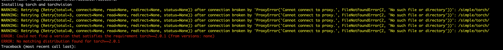

# stablediffusion-ui 在 m1-mac 上的安装

项目代码：
https://github.com/AUTOMATIC1111/stable-diffusion-webui

[安装步骤](https://github.com/AUTOMATIC1111/stable-diffusion-webui/wiki/Installation-on-Apple-Silicon)：

1. If Homebrew is not installed, follow the instructions at https://brew.sh to install it. Keep the terminal window open and follow the instructions under "Next steps" to add Homebrew to your PATH.
2. Open a new terminal window and run "brew install cmake protobuf rust python@3.10 git wget"
3. Clone the web UI repository by running git clone https://github.com/AUTOMATIC1111/stable-diffusion-webui
4. Place Stable Diffusion models/checkpoints you want to use into stable-diffusion-webui/models/Stable-diffusion. If you don't have any, see Downloading Stable Diffusion Models below.
5. cd stable-diffusion-webui and then ./webui.sh to run the web UI. A Python virtual environment will be created and activated using venv and any remaining missing dependencies will be automatically downloaded and installed.
6. To relaunch the web UI process later, run ./webui.sh again. Note that it doesn't auto update the web UI; to update, run git pull before running ./webui.sh.

如果在 m1-mac 上执行 "./webui.sh" 报错，需要删除环境变量 "SSLKEYLOGFILE=/Users/yuanjun/sslkeylogfile/keylogfile.log"

